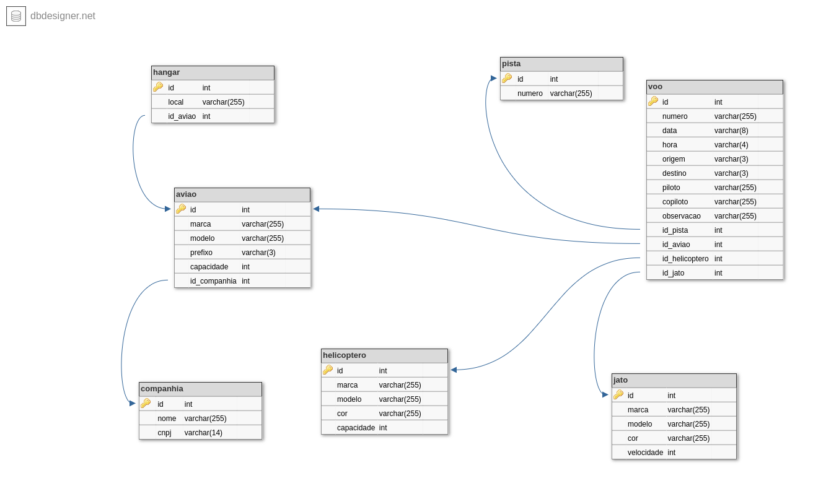

# Introdução
No Indicador Essencial "Desenvolve programas com o paradigma da Orientação a Objetos", o objetivo é desenvolver a capacidade de abstração, através dos critérios de Aplicabilidade e Visão Sistemêmica, Síntese, Análise, Relacionamento e Comparação, permitindo a utilização dos conceitos de Orientação a Objetos, a fim de resolver problemas contidianos, propondo soluções adequadas.

Para analisar o aprendizado, resolva o problema proposto, se utilizando das técnicas e pilares da orientação a objeto (abstração, polimorfismo, encapsulamento e herança). O desenvolvimento deverá considerar ao menos:
* Uma utilização de Generics além das propostas em sala de aula;
* Uma utilização de Interfaces além das propostas em sala de aula;
* Conexão com o banco de dados e suas boas práticas;
* Comentários de Código demonstrando a estrutura
* Indentação de Código
* Nomenclatura de variáveis que determinem sua utilização
* Aplicação das práticas de controle de versionamento GIT
  * Ao final de cada dia de atividade, deverão ser realizados os devidos Commits e Pull Requests

## Problema
O cliente Aeroporto Jatinho Feliz tem grandes problemas com a gestão de sua estrutura. Hoje ele contada com uma gama grande de aeromodelos que utilizam de suas instalações para procederem voos. Além disso, o mesmo conta com a estrutura de hangares para o devido armazenamento de aviões.

Desta forma, o cliente precisa controlar três tipos de Aeromodelos (Aeronaves), sendo elas Aviões, Helicopteros e Jatos.

Para tanto, o mesmo precisa controlar suas pistas de voo, que podem ser utilizadas por quaisquer uma das aeronaves, bem como controlar os hangares se estão locados com algum determinado avião. Outra informação relevante é que todo avião pertence a uma determinada companhia.

Por fim, precisam contolar os voos de entrada e saída em suas instalações, com todas as informações correlacionadas para que sejam apresentadas as ficalizações de auditoria.

Este controle será constituído de uma aplicação com Listar, Incluir, Alterar e Excluir das Entidades listadas abaixo:
* Avião
* Helicoptero
* Jato
* Companhia
* Hangar
* Pista
* Voo

As devidas informações de cada entidade estão detalhadass no MER e Diagrama de Classes abaixo. A utilização dos mesmos se trata de uma REFERÊNCIA podendo ser ajustado conforme a necessidade individual de cada trabalho.

### MER

### Diagrama de Classes

### Regras
* Cada avião possui uma única companhia;
* Somente serão criados aviões para companhias já cadastradas;
* Somente poderá existir um Avião por relação no Hangar, ou seja, caso seja atribuído um novo avião, deverá retornar mensagem de Erro;
* As capacidades de Helicoptero e Avião não podem ser negativas, assim como a velocidade do Jato;
* A numeração de cada Pista, o prefixo de cada Avião e o número de cada Voo são compostos de:
  * Numeração Pista: 1 letra e 2 números
  * Prefixo Avião: 3 letras e 4 números
  * Numeração de Voo: 3 letras e 6 números
* Os valores de data estão marcados como String, porém podem ser considerados como sql.Date, sendo que, caso utilizado como String, deverão seguir o formato YYYY-MM-DD. As horas terão o formato de HH:MM.
* O destino e a origem de cada voo é sempre composto de três letras.
* A listagem de todos os voos deverá ter uma opção de salvar em um arquivo de texto. O formato deste arquivo é livre.

## Entrega
* Deverá ser feita via Teams, informando o link do repositório do Github
* O repositório deverá ser PRIVADO até a data da entrega
* Cada dia de desenvolvimento (23/11, 28/11, 29/11 e 30/11) deverá representar um COMMIT e PULL REQUEST diferente de desenvolvimento, com a finalidade de avaliar o andamento de cada entrega
* Data Final: 06/12